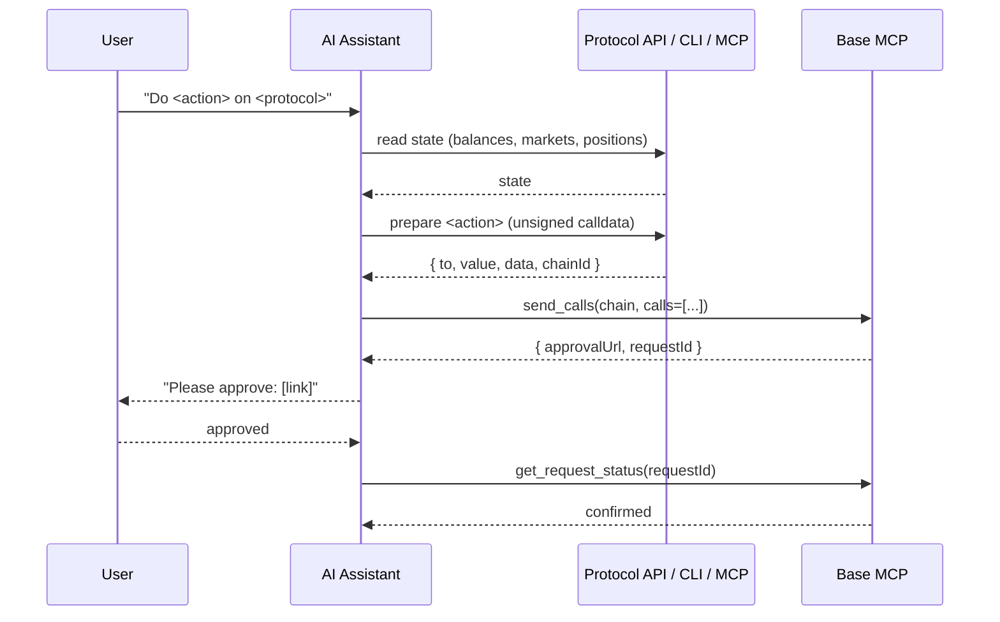

<Tip>
This page describes how the Base MCP Skill and Plugins work under the hood. If you just want to install it in Claude Desktop, ChatGPT, Cursor, or Claude Code, head to the [Quickstart](/ai-agents/quickstart).
</Tip>

## Why a skill on top of the MCP server

The MCP server exposes capabilities. Without context, models might get confused, calling write tools without warning the user, skipping approval, inventing parameters, or failing to detect that the server isn't connected at all. The skill closes that gap. Specifically, `SKILL.md` adds:

- **Detection and onboarding** — the assistant can call `get_wallets` when it needs wallet context, supported chains, or an address for a write flow.
- **Approval mode** — write tools (`send`, `swap`, `sign`, `send_calls`) return `{ approvalUrl, requestId }`. The skill tells the model to present the link, wait, then poll `get_request_status` — never to claim success before confirmation.
- **Tone rules** — load-bearing language conventions (e.g. "onchain", never "web3") and a beginner/sophisticated detection heuristic so responses match the user.
- **Plugin patterns** — documented prepare → `send_calls`, `swap`, and `sign` patterns that let external protocols extend the skill without modifying the MCP server.

## How SKILL.md is loaded

Skills use progressive disclosure. The model loads `SKILL.md` at session start (cheap — ~100 lines) and reads `references/*.md` and `plugins/*.md` only when a relevant task arises.

The shape of the Base MCP skill:

<Tree>
  <Tree.Folder name="skills/base-mcp" defaultOpen>
    <Tree.File name="SKILL.md" />
    <Tree.Folder name="references">
      <Tree.File name="install.md" />
      <Tree.File name="tone.md" />
      <Tree.File name="approval-mode.md" />
      <Tree.File name="batch-calls.md" />
      <Tree.File name="custom-plugins.md" />
    </Tree.Folder>
    <Tree.Folder name="plugins">
      <Tree.File name="morpho.md" />
      <Tree.File name="moonwell.md" />
      <Tree.File name="uniswap.md" />
      <Tree.File name="avantis.md" />
      <Tree.File name="aerodrome.md" />
      <Tree.File name="virtuals.md" />
      <Tree.File name="bankr.md" />
    </Tree.Folder>
  </Tree.Folder>
</Tree>

`SKILL.md` itself defines the session flow, approval handling, and plugin routing. The MCP tool descriptions are the source of truth for core tool parameters; plugin specs are loaded only when a relevant task arises, such as loading `plugins/morpho.md` for a Morpho vault request.

Read the canonical file at [`skills/base-mcp/SKILL.md`](https://github.com/base/skills/blob/main/skills/base-mcp/SKILL.md).

## How plugins extend the skill

A plugin is a markdown spec — one file in `plugins/` — that teaches the assistant how to drive an external protocol with Base MCP. Most onchain-action plugins prepare unsigned calldata and execute it through `send_calls`; others use a core tool such as `swap` or `sign`.

For calldata-based plugins, the contract is the same whether the protocol exposes an HTTP tx-builder, a CLI, or its own sibling MCP server:

Most calldata-based plugin files follow the same four-section shape:

<Steps>
  <Step title="Onboarding gate">
    A `STOP` notice forcing the assistant to complete Base MCP detection and onboarding before touching the plugin's tools.
  </Step>
  <Step title="Read endpoints">
    The GET endpoints, CLI commands, or read tools that return state — balances, positions, market data.
  </Step>
  <Step title="Prepare endpoints">
    The endpoints, CLI commands, or `prepare_*` tools that return unsigned calldata, with the exact response shape so the model knows which fields map to `to`, `value`, and `data`.
  </Step>
  <Step title="send_calls mapping">
    How to turn the prepare response into the `calls` array passed to Base MCP's `send_calls`.
  </Step>
</Steps>

Base MCP passes the calldata to Base Account for user approval. The protocol never touches private keys.

## Native vs custom plugins

<CardGroup cols={2}>
  <Card title="Native plugins" icon="puzzle-piece" href="/ai-agents/plugins/native">
    Morpho, Moonwell, Uniswap, Avantis, Aerodrome, Virtuals, and Bankr — authored by the Base team and shipped with the skill.
  </Card>
  <Card title="Build a custom plugin" icon="code" href="/ai-agents/plugins/custom-plugins">
    Write your own markdown spec for any protocol with an HTTP tx-builder, CLI, or MCP server.
  </Card>
</CardGroup>
