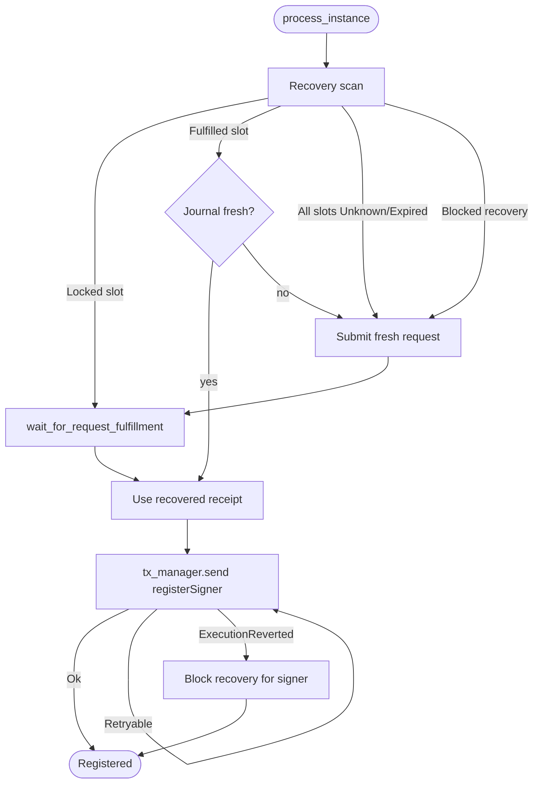

The registrar is an offchain service that maintains the onchain registry of accepted TEE signer
identities. It discovers running TEE prover instances, fetches AWS Nitro Enclave attestation
documents from each enclave, generates a ZK proof that the attestation is well-formed, and submits
the resulting signer registration to [`TEEProverRegistry`](https://github.com/base/contracts/blob/main/src/L1/proofs/tee/TEEProverRegistry.sol)
on L1. It also deregisters signers whose backing instances are no longer reachable, and revokes
intermediate certificates that AWS has withdrawn.

A registrar is operated by Base. The proof system trusts only signers that this registrar has
registered, so registrar correctness is a prerequisite for accepting TEE proofs onchain. Its output
is still self-validating: the attestation ZK proof, the enclave PCR0 measurement, and the signer
public key are all checked by `TEEProverRegistry` and [`NitroEnclaveVerifier`](https://github.com/base/contracts/blob/main/src/L1/proofs/tee/NitroEnclaveVerifier.sol)
before the signer becomes valid.

## Responsibilities

A conforming registrar performs the following work:

1. Discover the current set of TEE prover instances behind the production load balancer.
2. Fetch the per-enclave signer public keys and Nitro attestation documents from each instance.
3. Optionally check the attestation certificate chain against AWS-published CRLs and against the
   onchain durable revocation set.
4. Generate a ZK proof of attestation correctness for every enclave that is not yet registered.
5. Submit `TEEProverRegistry.registerSigner()` for newly attested signers.
6. Submit `TEEProverRegistry.deregisterSigner()` for onchain signers whose instances are gone.
7. Submit `NitroEnclaveVerifier.revokeCert()` for intermediate certificates discovered to be
   revoked.
8. Recover in-flight proof requests across process restarts without re-spending proving work.

The registrar does not gate which PCR0 measurements are accepted. Registration is PCR0-agnostic so
that the next image's signers can be pre-registered ahead of a hardfork. Acceptance of proofs
produced by a given signer is enforced onchain by [`TEEVerifier`](https://github.com/base/contracts/blob/main/src/L1/proofs/tee/TEEVerifier.sol)
against the current `TEE_IMAGE_HASH` of the active game implementation.

The registrar also does not create proposals, generate proof material for proposals or disputes,
or dispute invalid state transitions. Those responsibilities belong to the proposer, the TEE
provers, and the challenger.

## Startup Configuration

At startup, the registrar connects to:

- an L1 execution RPC for contract reads and transaction submission
- AWS APIs for ELBv2 target health and EC2 instance metadata
- a JSON-RPC endpoint on each discovered TEE prover instance
- a proving backend (Boundless marketplace or a self-hosted RISC Zero prover)
- `TEEProverRegistry`
- an optional `NitroEnclaveVerifier`, required only when CRL checking is enabled

The registrar reads no contract configuration at startup beyond the registry and verifier
addresses provided by the operator. It treats every onchain signer it has not seen in its own
instance set as an orphan candidate, so a single registrar must be the sole writer for a given
registry.

## Driver Loop

The registrar runs a single driver loop:

1. Discover the current instance set.
2. Process every instance concurrently, bounded by `max_concurrency`.
3. Read the onchain signer set.
4. Deregister orphan signers.
5. Sleep `poll_interval` seconds, or exit on cancellation.

The loop runs `step()` once on startup before sleeping. Cancellation is observed promptly between
ticks and inside long-running tx retries so the service can shut down without leaving partial
state.

## Instance Discovery

The registrar uses AWS ALB target group polling. DNS, SRV, and Kubernetes discovery are not
supported.

Each discovery cycle:

1. Calls `elasticloadbalancingv2.DescribeTargetHealth(target_group_arn)`.
2. Filters out non-instance targets (target IDs that do not start with `i-`).
3. Deduplicates instance IDs that appear on more than one port.
4. Calls `ec2.DescribeInstances(instance_ids)` to read each instance's private IP and launch time.
5. Builds JSON-RPC endpoint URLs of the form `http://{private_ip}:{prover_port}` and pairs each
   with its ALB-reported health state.

Health states map as follows:

| AWS state    | Internal state | `should_register()` |
| ------------ | -------------- | ------------------- |
| `initial`    | `Initial`      | true                |
| `healthy`    | `Healthy`      | true                |
| `draining`   | `Draining`     | false               |
| anything else| `Unhealthy`    | false               |

`Unhealthy` instances within `unhealthy_registration_window` seconds of `launch_time` are still
allowed to register. This is a warm-up grace period: it lets a new instance whose JSON-RPC
endpoint is briefly slow finish enclave attestation and registration before the next ALB health
check would deregister it. The window must be smaller than the Boundless proving timeout so that
a started proof can complete before the instance becomes ineligible.

Discovery failures abort that tick and skip orphan cleanup. They do not deregister live signers.

## Per-Instance Processing

For each discovered instance, the registrar:

1. Calls `enclave_signerPublicKey` to fetch the per-enclave SEC1 public keys. Each instance can
   host multiple enclaves and each enclave has its own signer key.
2. Derives the Ethereum signer address from each public key as the last 20 bytes of
   `keccak256(uncompressed_pubkey_xy)`.
3. Returns immediately if no signers were reported. The address set still contributes nothing for
   this instance and the call is a no-op.
4. Decides whether the instance is currently registerable:
   - `Initial` and `Healthy` instances proceed.
   - `Unhealthy` instances within the warm-up window proceed.
   - All other instances contribute their addresses to the active set but do not generate new
     proofs or transactions.
5. Generates a single 32-byte random nonce and calls `enclave_signerAttestation` once with that
   nonce. The nonce binds every per-enclave attestation in the returned batch to the same
   freshness commitment.
6. Performs CRL checks once per batch when CRL checking is enabled. Each enclave has its own
   signing key, but AWS Nitro attestations are signed by the parent EC2 instance's Nitro
   Hypervisor, whose signing key is endorsed by a per-instance AWS-issued certificate chain.
   Every enclave on the same instance therefore produces an attestation under the same parent
   chain, so a single CRL check per instance is sufficient.
7. For each signer address, runs the registration pipeline.

All reachable instances contribute to the active signer set, including `Draining` and `Unhealthy`
ones. This prevents an instance that is rotating in or out from being deregistered prematurely.

## Attestation Proof Generation

The registrar produces proof material for every signer not yet onchain by calling an
`AttestationProofProvider`. The provider returns:

```text
output      // ABI-encoded VerifierJournal (PCRs, public key, timestamp, cert hashes)
proofBytes  // Groth16 seal
```

`output` is the `VerifierJournal` consumed by `NitroEnclaveVerifier.verify()` during
`registerSigner()`. `proofBytes` is the Groth16 SNARK that proves the journal corresponds to a
valid Nitro attestation document.

The registrar supports two backends:

| Backend     | Description                                                                                                  |
| ----------- | ------------------------------------------------------------------------------------------------------------ |
| `boundless` | Submits the proving job to the Boundless marketplace using a dedicated wallet.                               |
| `direct`    | Loads the guest ELF locally and proves via `risc0_zkvm::default_prover()`, routing to Bonsai or a local prover according to RISC Zero environment variables. |

Both backends are valid production paths. `boundless` is the primary production backend.
`direct` is also used for local development and tests, but it is suitable for production fallback
when an operator needs to bypass the marketplace, for example during a Boundless incident or for
private-deployment scenarios.

For Boundless, the registrar submits a `RequestParams` containing the program URL, the attestation
input, the expected `image_id`, and a `prefix_match(image_id)` requirement so a fulfilled request
cannot be replayed against a different program. Onchain Boundless submissions are serialized
behind a mutex to avoid wallet nonce races.

### Restart Recovery

The registrar process is itself ephemeral. Across restarts, it must not re-spend proving work and
must not submit stale proofs. Boundless `RequestId` slots are derived deterministically:

```text
request_index(signer, attempt) = u32::from_be_bytes(keccak256(signer || attempt)[..4])
```

For each signer, the registrar probes `max_recovery_attempts` consecutive deterministic slots
before submitting a fresh request. The action depends on the slot status:

| Slot status   | Registrar action                                                                  |
| ------------- | --------------------------------------------------------------------------------- |
| `Unknown`     | Record the first such slot as the candidate fresh-submission slot; keep scanning. |
| `Locked`      | Resume `wait_for_request_fulfillment` and use the resulting receipt.              |
| `Fulfilled`   | Fetch the receipt and check journal freshness before accepting it.                |
| `Expired`     | Skip the slot permanently; continue scanning.                                     |

A `RequestIsNotLocked` revert encountered mid-scan is treated as in-flight and short-circuits to
waiting on that slot.

If a recovered receipt's attestation timestamp is older than `max_attestation_age`, the registrar
discards it and submits a fresh request in the candidate slot. The default freshness window is
3300 seconds, kept strictly under the onchain `MAX_AGE` of 3600 seconds so a recovered proof can
still be submitted before it ages out onchain.

After an `ExecutionReverted` from `registerSigner()`, the signer is added to a per-process
`recovery_blocked` set. The next cycle skips the recovery scan for that signer and submits a fresh
request, so a known-bad recovered proof is never tried twice. The set is cleared on restart, which
gives one fresh attempt per process even for previously blocked signers.

## Registration Transactions

For each unregistered signer, the registrar:

1. Calls `TEEProverRegistry.isRegisteredSigner(signer)`. If true, the signer is skipped.
2. Generates or recovers proof material as described above.
3. ABI-encodes `registerSigner(output, proofBytes)`.
4. Submits the transaction through the L1 transaction manager.
5. Retries failed submissions according to the rules below.
6. On a successful receipt, increments the registration counter.

The transaction retry rules are:

| Failure                       | Required behavior                                                                                       |
| ----------------------------- | ------------------------------------------------------------------------------------------------------- |
| Retryable error               | Sleep `tx_retry_delay`, then retry, up to `max_tx_retries` total attempts.                              |
| `ExecutionReverted` revert    | Block recovery for this signer so the next cycle generates a fresh proof, then return the error.       |
| Insufficient funds, fee cap   | Treat as non-retryable. Surface the error and stop attempting this signer for the current cycle.        |
| Reverted receipt              | Treat as a transaction failure even when submission succeeded.                                          |
| Reported error after mining   | Re-read `isRegisteredSigner(signer)`. If true, treat the attempt as success.                            |

The post-error reconciliation is required because fee-bumping and nonce races can return errors
even when the underlying transaction has already been mined. Without the recheck, the registrar
would burn proving work generating a fresh proof for an already-registered signer.

Transaction submission is cancellation-aware: both the active send and the inter-attempt sleep
abort cleanly on shutdown, so the next process starts from a clean nonce state without committing
a partial transaction.

## Orphan Deregistration

After processing every instance, the registrar reconciles the onchain signer set against the
active set:

1. If discovery failed for this tick, skip cleanup.
2. If cancellation was requested, skip cleanup.
3. Compare the number of reachable instances against the total discovered instances. If
   `reachable_instances * 2 <= total_instances`, skip cleanup.
4. Read the onchain set with `TEEProverRegistry.getRegisteredSigners()`.
5. Compute `orphans = onchain_signers \ active_signers`.
6. For each orphan, in order:
   1. Recheck `isRegisteredSigner(signer)`. Skip if it returns false.
   2. ABI-encode `deregisterSigner(signer)` and submit it through the transaction manager.

The majority-reachable guard prevents a transient AWS or VPC outage from deregistering most of
the prover fleet at once. The per-orphan `isRegisteredSigner` recheck is a race guard: the set
returned by `getRegisteredSigners()` is read once per cycle, and another writer could have
deregistered a signer between that read and this transaction. Skipping already-deregistered
addresses avoids wasted gas on a no-op transaction.

This procedure assumes a single registrar per `TEEProverRegistry`. Two registrars sharing a
registry would each treat the other's signers as orphans.

## Certificate Revocation

When the operator enables CRL checking, the registrar enforces revocation using two layers in
order. Both are required to make CRL handling safe.

### Layer 1: Onchain Durable Revocation Pre-Check

For each intermediate certificate in the attestation chain, the registrar reads
`NitroEnclaveVerifier.revokedCerts(certPathDigest)`. Any hit blocks registration for that batch
and skips Layer 2 entirely.

This layer protects against a known attack against the cached-cert path: an intermediate that was
once revoked onchain could be reintroduced through a later `_cacheNewCert` write if its CRL entry
is later pruned by AWS. Reading the durable mapping first ensures a revoked cert cannot be
silently rehabilitated.

RPC errors against `revokedCerts` fail open and fall through to Layer 2, but are counted as
revocation check errors. `RegistrationDriver::new` requires a `NitroEnclaveVerifier` client when
CRL checking is enabled and rejects misconfiguration at startup.

### Layer 2: AWS CRL Distribution Points

For intermediates that pass Layer 1, the registrar:

1. Parses each CRL distribution point from the chain.
2. Validates the URL host against an allowlist requiring the `.amazonaws.com` suffix and the
   `nitro-enclave` keyword. HTTP redirects are disabled and responses are bounded to 10 MiB.
3. Fetches the CRL with a configurable timeout.
4. Searches for the certificate's serial number.
5. For each revoked intermediate, submits `NitroEnclaveVerifier.revokeCert(certPathDigest)`.
6. Returns true if any intermediate is revoked, blocking registration for the batch.

`revokeCert` failures are counted but do not abort registration of other instances on the same
tick. The submitted revocations transition Layer 1 to a hit on the next cycle so subsequent
registrations can short-circuit without re-fetching the CRL.

## Pending Registration Lifecycle

Each per-signer pipeline is keyed by Ethereum signer address. The Boundless proof slot for a
signer transitions through:



A pending recovery state, a fulfilled-but-stale receipt, and an `ExecutionReverted` revert all
funnel back to a fresh submission on the next tick rather than wedging the signer.

## Onchain Interactions

The registrar uses the following contract calls. `TEEProverRegistry.isValidSigner()` is
intentionally not called by the registrar; that predicate is enforced by `TEEVerifier` at proof
submission time and includes an image-hash match that the registrar cannot satisfy by itself.

| Contract                                                                                                                   | Method                          | Caller path                                         |
| -------------------------------------------------------------------------------------------------------------------------- | ------------------------------- | --------------------------------------------------- |
| [`TEEProverRegistry`](https://github.com/base/contracts/blob/main/src/L1/proofs/tee/TEEProverRegistry.sol)                 | `registerSigner(output, proof)` | Per-signer registration transaction.                |
| [`TEEProverRegistry`](https://github.com/base/contracts/blob/main/src/L1/proofs/tee/TEEProverRegistry.sol)                 | `deregisterSigner(signer)`      | Per-orphan deregistration transaction.              |
| [`TEEProverRegistry`](https://github.com/base/contracts/blob/main/src/L1/proofs/tee/TEEProverRegistry.sol)                 | `isRegisteredSigner(signer)`    | Pre-check, post-error reconciliation, orphan race guard. |
| [`TEEProverRegistry`](https://github.com/base/contracts/blob/main/src/L1/proofs/tee/TEEProverRegistry.sol)                 | `getRegisteredSigners()`        | Once per cycle for orphan computation.              |
| [`NitroEnclaveVerifier`](https://github.com/base/contracts/blob/main/src/L1/proofs/tee/NitroEnclaveVerifier.sol)           | `revokeCert(certHash)`          | When AWS CRL revokes an intermediate.               |
| [`NitroEnclaveVerifier`](https://github.com/base/contracts/blob/main/src/L1/proofs/tee/NitroEnclaveVerifier.sol)           | `revokedCerts(certHash)`        | Layer-1 onchain durable revocation pre-check.       |

PCR0 enforcement happens onchain at proof submission, not at registration. The registrar registers
any enclave whose Nitro attestation verifies, regardless of its PCR0. This allows the next image's
fleet to be brought up and pre-registered in advance of a hardfork; those signers cannot produce
accepted proposals until the active game implementation's `TEE_IMAGE_HASH` matches their
registered image hash.

## Service Lifecycle

At startup, the registrar:

1. Parses CLI configuration and validates it.
2. Initializes tracing and installs the `rustls` ring crypto provider.
3. Installs a signal handler that triggers a cancellation token.
4. Initializes Prometheus metrics, including L1 wallet and Boundless wallet balance monitoring.
5. Builds the L1 provider, transaction manager, AWS SDK clients, and discovery client.
6. Builds the registry client and the optional Nitro verifier client.
7. Builds the proof provider for the configured backend.
8. Starts the health server and marks readiness.
9. Starts the driver loop.

The health endpoint reports ready as soon as wiring completes. Connectivity gating is intentionally
omitted because the registrar is outbound-only.

Each driver tick:

1. Discovers instances.
2. Processes instances concurrently.
3. Computes orphans subject to the majority-reachable guard.
4. Submits deregistration transactions for confirmed orphans.

Shutdown is driven by a cancellation token. The driver loop exits, in-flight per-instance futures
are dropped, the readiness flag clears, the `up` metric is set to zero, and the health server is
joined.

## Operator Inputs

A registrar needs:

- L1 RPC endpoint and chain ID.
- `TEEProverRegistry` address.
- AWS region and ALB target group ARN.
- Prover JSON-RPC port shared by the fleet.
- L1 transaction signer (local key, or remote signing endpoint plus expected address).
- Proving backend selection: `boundless` or `direct`.
- For `boundless`: marketplace RPC URL, dedicated wallet key, guest program URL, polling interval,
  prove timeout, recovery attempt limit, and attestation freshness window.
- For `direct`: path to the guest ELF.
- Poll interval, prover JSON-RPC timeout, max concurrency, max transaction retries, transaction
  retry delay, and the unhealthy registration warm-up window.

Optional inputs:

- CRL checking enable flag.
- `NitroEnclaveVerifier` address, required when CRL checking is enabled.
- CRL fetch timeout.
- Health server bind address and port.
- Logging filter and Prometheus metrics settings.

## Safety Requirements

A registrar implementation must preserve these safety properties:

- Do not deregister live signers because of a transient AWS or VPC outage. Apply a
  majority-reachable guard before any deregistration.
- Treat `Draining` and `Unhealthy` instances as part of the active set as long as their JSON-RPC
  endpoint responds, so rotations do not race deregistration.
- Use a fresh random nonce per instance batch and pass it to the enclave attestation request so
  the verifier journal carries an unguessable freshness commitment.
- Derive Boundless request slots deterministically from the signer address so a restarted process
  can recover in-flight proving work without spending fresh proof costs.
- Reject recovered proofs whose attestation timestamp is older than `max_attestation_age` to keep
  recovered proofs strictly inside the onchain `MAX_AGE` window.
- Block recovery for a signer after an `ExecutionReverted` so the next cycle proves freshly
  rather than re-submitting the same bad proof.
- Recheck `isRegisteredSigner` after a transaction error to absorb fee-bump and nonce-race false
  negatives.
- Recheck `isRegisteredSigner` for every orphan candidate immediately before submitting a
  deregistration, so a concurrent writer or earlier in-flight tx cannot cause a redundant
  deregistration transaction.
- When CRL checking is enabled, run the onchain durable revocation pre-check before fetching
  network CRLs so a previously revoked intermediate cannot be silently rehabilitated.
- Restrict CRL fetches to allowlisted hosts and bound the response size to defeat SSRF and
  resource-exhaustion attacks.
- Treat unavailable AWS APIs, unreachable prover endpoints, transient RPC errors, and Boundless
  polling failures as retryable conditions for the next tick rather than as deregistration or
  failure signals.
